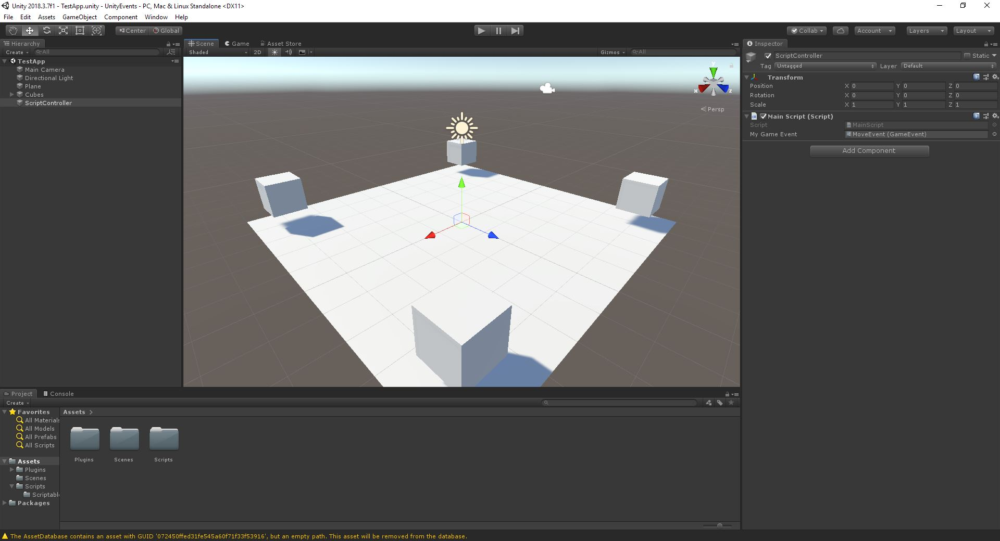

Simple Unity project demonstrating a few simple, but powerful constructs in Unity

1. Scriptable Objects

2. Events

3. Event Listeners

_In this project:_

**1 - A Scriptable Object** (**Assets/Scripts/ScriptableObjects/GameEvent.cs**) is used to create the Event asset construct. 
The Event is a generic asset that registers and unregisters listeners.
Because this script has [CreateAssetMenu] as a decorator, it appears as a context menu item that can be right click created in the Projects tab.

In this project, you'll notice a '**MoveEvent**'asset. This is a GameEvent. Ultimately, in larger apps - there will be many of these, each with a different name for its purpose.

**2 - An Event Listener** script (**Assets/Scripts/ScriptableObjects/GameEventListener.cs**)is what gets attached to any app/game components that want to listen for an event that other components may raise.

**3 - A ScriptController game object** has a script attached (**Assets/Scripts/MainScript.cs**) which has, as a single variable input, a GameEvent object. 
For this project, the '**MoveEvent**'asset is what will be used. Inside the MainScript, there is an IEnumerator which raises the MoveEvent, every fiew seconds.

**4 - Lastly, the project has a set of cube game objects**, which each use the Event Listener script. Using the same '**MoveEvent**'asset as the input for the Listener, once the Event has been recieved - the script invokes a designated function in a script attached to some component (in this case, its the same Cube game object)

A script named (**Assets/Scripts/HandleMove.cs**) is attached to each Cube object. Within the script is a public function which is invoked to perform functionality - in this case, it moves the cube in a direction.  The public function in this script is what is set as the parameter in the Event Listener script - as the object to invoke after the Event is received.

